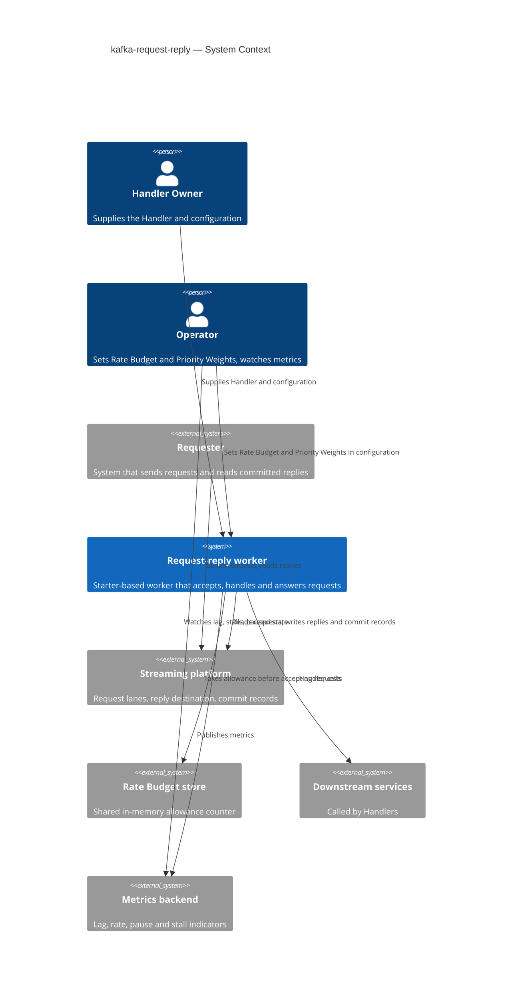
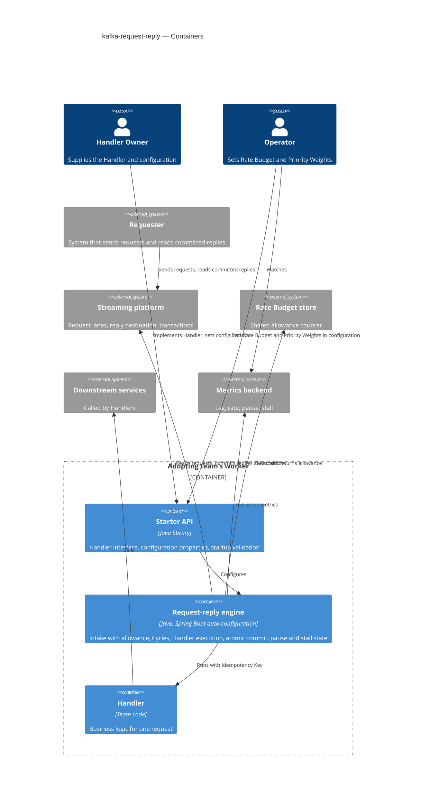
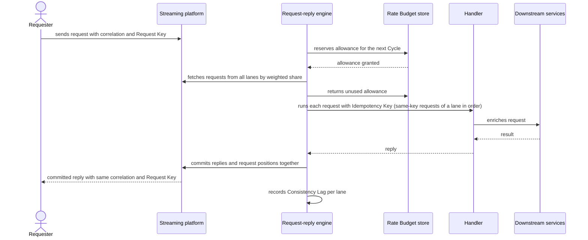
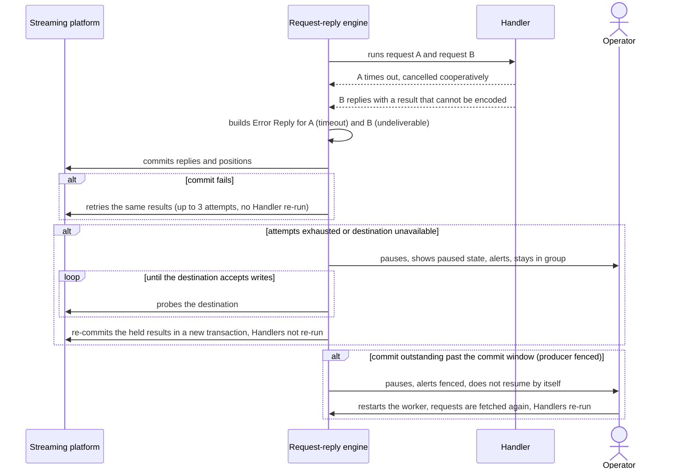
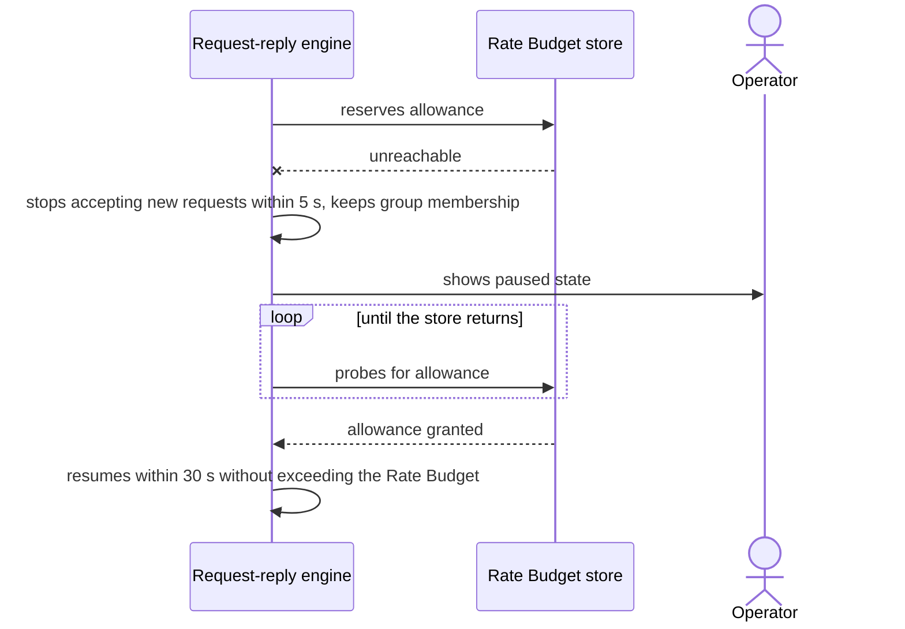
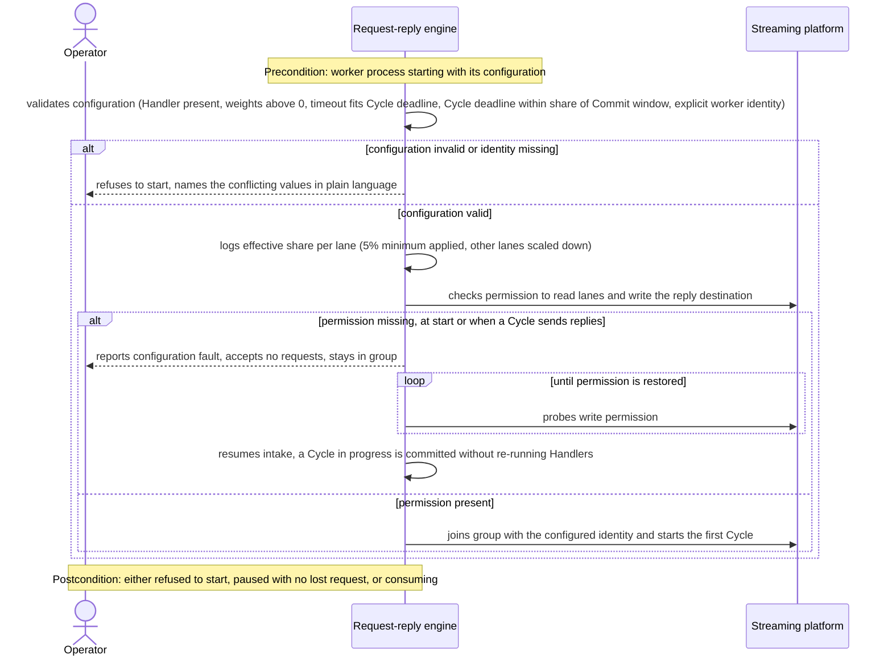
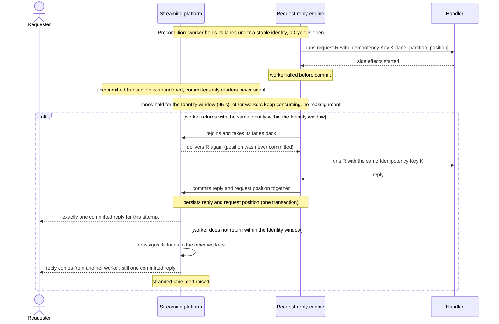
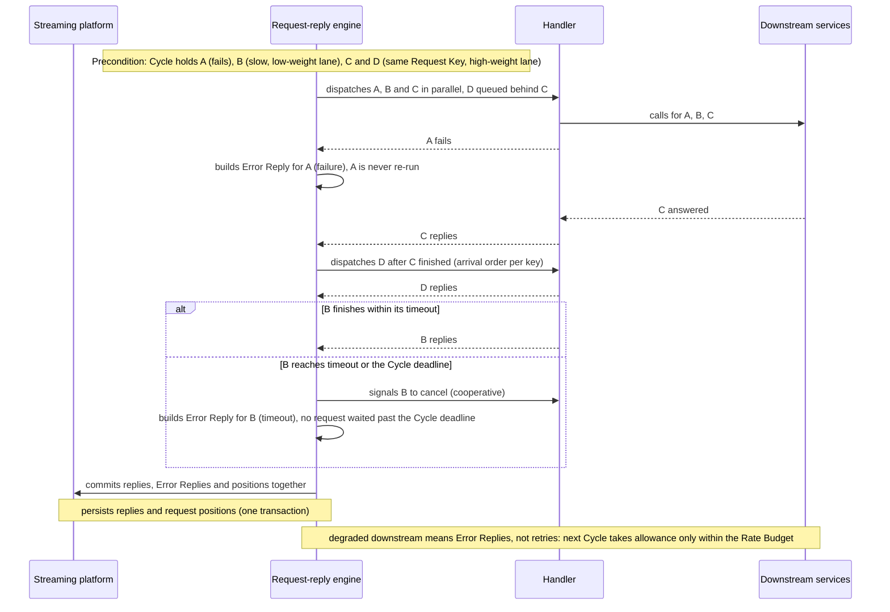
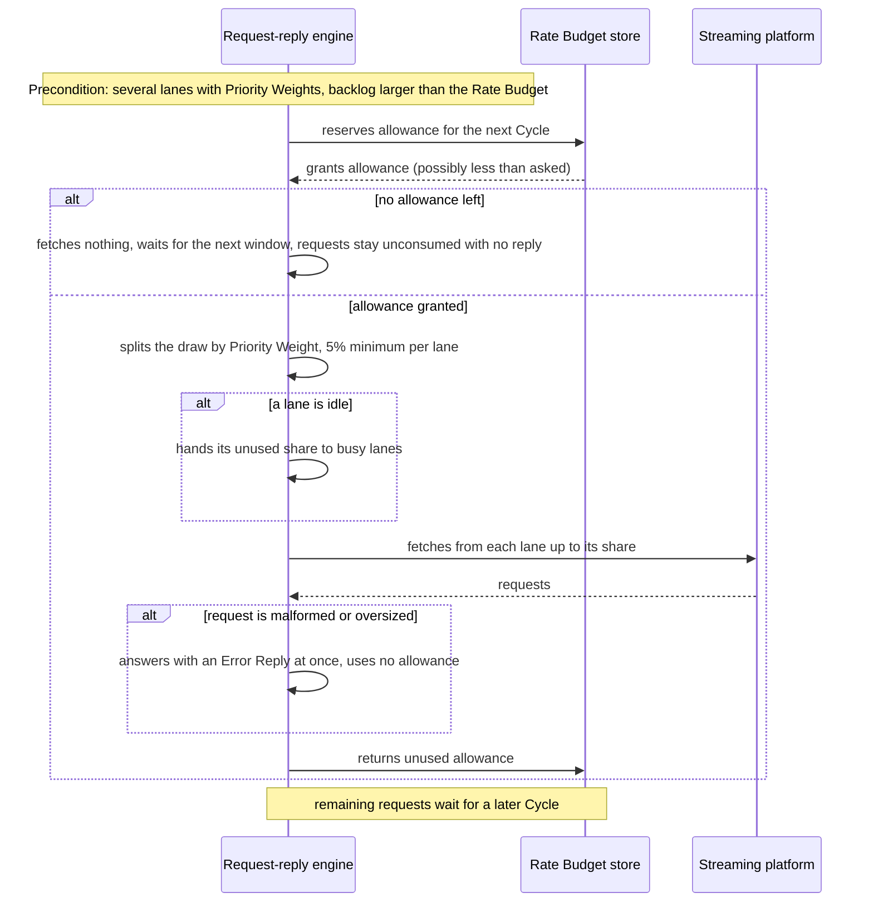
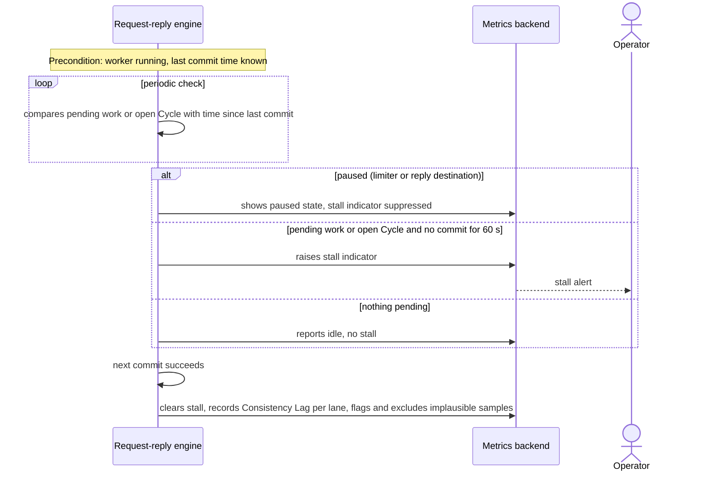

# Software Architecture Document — kafka-request-reply

<!-- 12 Arc42 sections. Empty section → <!-- N/A: <one-line reason> -->. -->
<!-- C4 Context (L1) lives inline in §3. C4 Container (L2) lives inline in §5. -->
<!-- Numbers in §10 come VERBATIM from spec.md §6 NFR — no inventing, no rounding. -->

## 1. Introduction and goals

**Intent.** A reusable internal starter that lets a Handler Owner build a request-reply worker by supplying only a Handler and configuration. The worker enforces one global Rate Budget across all workers of a group, shares it between Priority Lanes by Priority Weight, runs Handlers in parallel under a per-request timeout, and commits every reply (or Error Reply) together with the request positions so a Requester never sees a duplicate committed reply. Operators watch Consistency Lag and stalls.

**Top-3 quality goals (1-liners; full scenarios in §10):**

1. **Downstream protection:** accepted requests stay within the Rate Budget (×1.10 in any sliding 1 s window) across all workers, and the worker fails closed when the limiter is unavailable.
2. **Reply integrity:** 0 lost or duplicated committed replies, including under restarts and failed Cycles.
3. **Rollout stability:** 0 lane reassignment for workers that return within the Identity window.

**Stakeholders.**

| Role | Interest | Sign-off owner? |
|---|---|---|
| Handler Owner | Writes a Handler and configuration only; gets an Idempotency Key | No |
| Requester | Gets one reply or Error Reply carrying its Request Key and correlation | No |
| Operator | Sets Rate Budget and Priority Weights; watches Consistency Lag, stalls, paused state | No |
| Tech Lead | SAD approval | Yes |
| Security Lead | Review of payload handling and permissions (spec §6.1: required) | Yes |

Decision override: allowance is counted at Cycle intake — rationale: allowance is reserved before fetching and returned when unused (ADR-0006), so "accepted" means the unit stays consumed when the request enters the Cycle; spec AC-10 words this as "handed to a Handler", which can be seconds later for same-key requests. The limiter and the "accepted per second" metric count the same event.

## 2. Constraints

**Technical.**
- Java 25 (Gradle toolchain), Spring Boot 4.1.1 (`build.gradle`), Spring for Apache Kafka via `spring-boot-starter-kafka`, Micrometer via `spring-boot-starter-actuator`.
- Streaming platform: Apache Kafka; the reply path needs transactions (reply and request positions committed together), so the cluster must support them.
- Rate Budget store: a shared in-memory store that XME already operates, Redis-compatible for the first adapter, behind a port (see ADR-0003).
- Architecture convention: none yet in this repo (greenfield skeleton, single `xme.common.kfkprocessor` package); this SAD sets it.
- Override note: the repo is a runnable Spring Boot application (boot plugin, web and REST client starters, devtools). It hosts the library for now (ADR-0001, §5); web and REST client dependencies are not part of the starter contract and must not be pulled into adopters. Risk in §11.

**Organisational.**
- Deadline and effort budget: not stated (to be set by the Product Owner, see §11 and spec §8).
- Success: one production service, then a second team adopting by writing only a Handler.

**Conventions.**
- No convention file in the repo; Lombok is available; tests use `@SpringBootTest` + Testcontainers (`TestcontainersConfiguration`).
- Spec §6.1: payload content is never copied into logs, metrics or Error Replies.

**Regulatory / external.**
- Data classification internal; payloads may contain personal data owned by the adopting teams; security review required (spec §6.1).
- A stable worker identity is a hard requirement (spec §3, AC-15).

## 3. Context and scope

XME teams run workers that take requests from a streaming platform, call other services or databases, and send replies. The starter is the shared engine inside such a worker: it controls how fast requests are accepted, how they are executed, and how replies are committed.

<!-- brownfield: bare Spring Boot 4.1.1 / Java 25 / Gradle application skeleton (`xme.common.kfkprocessor`), no worker code, Testcontainers Kafka wired in tests; no architecture map (`survey` not run). -->

**External systems (in / out):**

| Actor or system | Type | Interaction |
|---|---|---|
| Requester | System | Sends requests with a correlation identifier and Request Key; reads committed replies |
| Handler Owner | Person | Supplies the Handler and configuration |
| Operator | Person | Sets Rate Budget and Priority Weights; watches metrics and alerts |
| Request lanes and reply destination | System (internal) | The worker reads requests from N lanes and writes replies and commit records |
| Rate Budget store | System (internal) | Shared allowance counter for the worker group |
| Downstream services and databases | System (internal/external) | Called by Handlers; protected by the Rate Budget |
| Metrics backend | System (internal) | Receives Consistency Lag, accepted rate, pause and stall indicators |

**C4 Context (L1):**



## 4. Solution strategy

**Target surfaces:** `library-sdk` (Handler interface and configuration are the public contract) and `worker` (the engine running inside each adopting team's service). Decided in ADR-0001; there is no UI surface, so no UI-architecture decision applies.

**Top strategic choices (the seeds for ADRs):**

1. **One Cycle, one commit.** A Cycle gathers requests from all lanes, runs Handlers in parallel, then commits every reply (or Error Reply) together with the request positions in one transaction whose timeout is the Commit window. Handlers stay at-least-once and receive an Idempotency Key. Serves quality goal 2 (ADR-0002).
2. **Rate Budget at intake from a shared store, fail closed.** Allowance is taken before requests are fetched and unused allowance is returned; the worker pauses when the store is unreachable. Serves quality goal 1 (ADR-0003, ADR-0006).
3. **Every lane in every worker, weights split per worker.** Each worker consumes every Priority Lane (partitions spread across workers) and splits its allowance draw by Priority Weight, redistributing idle shares with a 5% minimum (ADR-0004).
4. **Stable identity everywhere.** One configured worker identity drives group membership, the transaction identity and lane holding for the 45 s Identity window. Serves quality goal 3 (ADR-0005).
5. **Handlers on virtual threads.** Each request runs on its own virtual thread; the timeout starts at dispatch, cancellation is cooperative, requests sharing a Request Key run in arrival order within a lane, and every failure becomes an Error Reply. Ordering across lanes is an open question (§11). Execution detail inside one module (no ADR: reversible).

Each tactical decision in later sections should trace to one of these seeds. Tactical decisions that contradict a strategic choice are red flags and go to §11.

## 5. Building block view

Hexagonal layering inside one module for now (the repo stays a single Gradle module, ADR-0001 notes the later split): an `engine` core that knows nothing about the platform client, the store or the metrics registry, talking through ports implemented by adapters. Spring Boot auto-configuration wires it from configuration properties and the team's Handler bean.

**Internal decomposition:**

```
xme.common.kfkprocessor.requestreply/
├── api/          Handler interface, request/reply/Error Reply types, configuration properties (library-sdk contract)
├── engine/       Cycle loop, intake with allowance, lane weights, Handler execution, commit, pause/stall state
├── ports/        AllowanceStore, RequestLanes, ReplySink (transactional), WorkerMetrics
├── adapters/     Kafka (lanes + transactional reply sink), shared-store allowance (Redis-compatible), Micrometer
└── autoconfig/   Spring Boot auto-configuration, startup validation: configuration (AC-02), explicit unique worker identity (AC-15, ADR-0005), permission to write the reply destination (AC-09)
```

Intake follows ADR-0006 (allowance reserved before fetching, unused returned). **Decision (inline, no ADR):** single Gradle module for now; extract a `starter` module plus an example worker when a second team adopts (risk in §11).

**C4 Container (L2):** one container per declared target surface: the starter API (`library-sdk`) and the engine (`worker`).



## 6. Runtime view

**Critical flow 1: normal Cycle**



**Critical flow 2: failures inside a Cycle (timeout, undeliverable reply, failed commit), per ADR-0007**



**Critical flow 3: limiter outage and recovery**



**Critical flow 4: startup validation and reply-destination permission (AC-02, AC-15, AC-09)**



**Critical flow 5: worker killed mid-Cycle, restart with the same identity (AC-03, AC-05, AC-14)**



**Critical flow 6: failed, slow and ordered requests in one Cycle (AC-06, AC-07b, AC-07c, AC-13, AC-19)**



**Critical flow 7: allowance split across lanes, exhausted budget and idle lanes (AC-10b, AC-11, AC-12)**



**Critical flow 8: stall detection and pause state (AC-16, AC-17)**



**Flow notes (for `design`):** flows 4-8 reuse the domain participant names of flows 1-3 (§5 building blocks), not the generic `<service>`/`<data-store>` vocabulary, to stay consistent with the existing blocks. Flows 5 and 6 persist only the reply and request position inside the platform transaction, and flow 7 touches only the allowance counter, so no new relational entity or index is implied. Idempotency strategy (key = lane + partition + position) and commit retry shape are already covered by ADR-0002 and ADR-0007; no new ADR-worthy decision found.

## 7. Deployment view

The engine runs inside each adopting team's service as replicas with a stable identity (one identity per replica, held for the Identity window of 45 s after a replica disappears). Replicas can be added up to the partition count of the busiest lane; beyond that they sit idle. The Rate Budget store and the streaming platform are shared infrastructure operated outside this feature.

**Monitoring:**
- Metrics: accepted requests per second, Consistency Lag per lane, paused state, stall indicator, timeouts and Error Replies by category, commit attempts, group membership changes.
- Alerts: stall (work pending, no commit for 60 s), pause (limiter or reply destination), commit retries exhausted, stranded lane (a worker gone longer than the Identity window).
- Alert rules (AC-17): a stall is raised only when requests are pending or a Cycle is open and nothing commits for 60 s; an idle worker raises none, and a pause is shown as its own state and suppresses the stall indicator.
- Tracing: correlation identifier carried in logs and spans; never payload content.

**Scaling thresholds:**
- Target throughput: ≥ 2,000 requests/s per worker group (spec §6, provisional), checked by a load test in the performance environment.
- Parallelism per lane is capped by its partition count.

## 8. Crosscutting concepts

| Concept | Convention | Where defined |
|---|---|---|
| Logging | Structured; correlation identifier and lane only; payload content never logged | here, spec §6.1 |
| Authentication / authorization | The worker identity needs permission to read its lanes and write the reply destination and commit records; a missing permission pauses intake (AC-09) | here |
| Error handling | Handler failure, timeout and undeliverable reply become Error Replies (failure, timeout, undeliverable) with category and correlation only; destination outage pauses the worker (ADR-0007) | here, spec §8 |
| ID strategy | Idempotency Key = lane + partition + position of the request: stable across re-execution, identifies the attempt, not the business operation; correlation identifier and Request Key echoed unchanged | here |
| Ordering | Same-key requests run in order within a lane; Requesters must send same-key requests to one lane (see §11) | here |
| Internationalisation | N/A, no human-facing text beyond operator messages in English | none |
| Observability | Micrometer metrics (§7); lag samples that are negative or implausible are flagged and excluded | here |
| Events | Reply and Error Reply format and correlation rules finalised at the `api` stage (spec §8) | spec §8 |
| Rate limiting | Allowance reserved before fetching, returned when unused, fail closed; the limiter and the "accepted per second" metric count the same event (allowance consumed at Cycle intake, §1 override); Rate Budget and Priority Weights are set by the Operator in the worker configuration, identical in all workers of a group (the store holds only the counter), so changing them needs a rollout and startup logs the effective shares | ADRs, here |

## 9. Architecture decisions

| # | Title | Status | Section |
|---|---|---|---|
| 0001 | Ship the engine as a Spring Boot starter run inside each worker | Accepted | §4 |
| 0002 | Commit replies and request positions in one transaction per Cycle | Accepted | §4 |
| 0003 | Take the Rate Budget from a shared store behind a port and fail closed | Accepted | §4 |
| 0004 | Consume every lane in every worker and split each worker's allowance draw by Priority Weight | Accepted | §4 |
| 0005 | Require a stable worker identity for group membership and transactions | Accepted | §4 |
| 0006 | Reserve Rate Budget allowance before fetching requests and return the unused part | Accepted | §5 |
| 0007 | Turn send failures into Error Replies and retry commits without re-running Handlers | Accepted | §6 |

ADR files live in `docs/features/kafka-request-reply/adr/`, named `NNNN-title.md`.

## 10. Quality requirements

**QG-1. Downstream protection**
- **When:** several workers share one Rate Budget and a backlog exists, or the Rate Budget store becomes unreachable.
- **Then:** accepted rate ≤ Rate Budget × 1.10 in any sliding 1 s window (provisional); new requests stop within 5 s of the store becoming unreachable and resume within 30 s of its return (provisional); aggregate throughput ≥ 2,000 requests/s per worker group (provisional).
- **How verify:** load test in the performance environment against the worker "accepted per second" metric (counted at Cycle intake, the same event the limiter counts) vs the configured budget; failure-scenario test that cuts the store.

**QG-2. Reply integrity**
- **When:** a worker is killed mid-Cycle, a commit fails, or a reply is too large or cannot be encoded.
- **Then:** lost or duplicated committed replies = 0; Handlers are not re-run because of a send failure.
- **How verify:** failure-scenario test suite (kill mid-Cycle, failed commit, oversized reply, unavailable destination) reading committed replies only; production reconciliation of requests against replies.

**QG-3. Rollout stability**
- **When:** workers are restarted one by one, each returning with the same identity within 45 s (provisional).
- **Then:** lane reassignment = 0 for workers that return within the identity window; other workers keep consuming.
- **How verify:** rollout test plus the group membership change counter.

**QG-4. Predictable Cycle behaviour**
- **When:** lanes are busy, a Handler is slow, or commits take long.
- **Then:** each lane within ±10 percentage points of its weight when all lanes are busy (provisional); Handler timeout default 30 s from dispatch, configurable (provisional); Cycle deadline ≤ 80% of the commit window, checked at startup (provisional); commit window 60 s (provisional); every lane has a weight above 0, startup refuses a weight of 0; stall indicator when work is pending and 60 s pass without a commit (provisional). Consistency Lag p95 target is TBD (spec §8) and is added here when set.
- **How verify:** per-lane accepted-rate metric under a busy-lanes load test; startup validation tests; timeout counter and cycle-duration metric; stall-indicator metric in a failure-scenario test.

## 11. Risks and technical debt

| Risk / debt | Severity | Mitigation | Owner | Due |
|---|---|---|---|---|
| No trigger or deadline for the feature is confirmed (spec §8 Q1) | Medium | Treat as platform investment; confirm before tasks are planned | Product Owner | before `sdd:tasks` |
| Provisional timing numbers: a 30 s Handler timeout can hold a Cycle, high-weight lanes included, up to the Cycle deadline; a fixed 60 s stall threshold gives false stalls if the Commit window is 75 s or more (spec §1 decision override, spec §8 Q2) | Medium | Tech Lead confirms numbers knowingly; load test measures head-of-line delay | Tech Lead | before `sdd:tasks` |
| The Rate Budget store is a hard dependency of intake: its outage pauses every worker (ADR-0003) | Medium | Operate the store highly available; pause alert; failure-scenario test | Operator lead | before first production release |
| Weight accuracy depends on partitions spread evenly across workers (ADR-0004) | Medium | Load test against ±10 percentage points; per-lane buckets as a later upgrade | Tech Lead | before first production release |
| Rate Budget and Priority Weights are set per worker configuration; a mismatch between workers or a mid-rollout change gives an inconsistent budget | Medium | Same values in all workers; changes only through a rollout; startup logs the effective shares | Operator lead | before first production release |
| Requesters reading uncommitted replies see abandoned commits; a stuck commit delays everyone for the Commit window (ADR-0002, spec §8 Q6) | High | Document the committed-reads-only requirement in the starter guide | Tech Lead | before `sdd:tasks` |
| Lost or scaled-down workers hold their lanes until the Identity window ends (ADR-0005, spec §8 Q7) | Medium | Runbook plus stranded-lane alert | Operator lead | before `sdd:tasks` |
| Cycle results are held in memory during commit retries and pauses; a crash re-runs Handlers (at-least-once, ADR-0007) | Low | Idempotency Key; documented in the starter guide | Handler Owner | starter guide |
| Repo is a Spring Boot application, not a library; the engine lives in one module for now and web dependencies could leak into adopters (§2 override) | Medium | Extract a `starter` module plus an example worker when a second team adopts; keep web dependencies out of the starter contract | Tech Lead | when a second team adopts |
| Open architectural decision: cross-lane ordering of same-key requests | Open question | Guarantee is order per key within a lane; Requesters must send same-key requests to one lane (cross-lane order is not guaranteed: a low-share lane can deliver an older request in a later Cycle); tighten spec AC-07c ("arrival order") to "within a lane" and state the rule in the starter guide | Tech Lead | before `sdd:tasks` |
| Open architectural decision: per-key ordering may cut parallelism against the 2,000 requests/s target (spec §8) | Open question | Measure with the pilot service's real key distribution | Tech Lead | before `sdd:tasks` |
| Open architectural decision: correlation identifier name, echo rules and Error Reply format (spec §8 Q5) | Open question | Defaults: echoed unchanged; categories failure, timeout, undeliverable | Tech Lead | before `sdd:api` |
| Open architectural decision: Consistency Lag p95 target and adoption timeframe (spec §8 Q9) | Open question | Measure the pilot service first | Product Owner | before first production release |
| Open architectural decision: shared-store client for the Rate Budget (Bucket4j candidate, ADR-0003) | Open question | Confirm library and Redis-compatible store version | Tech Lead | before `sdd:tasks` |

**Accepted debt (acceptable in v1, plan to fix later):**
- Weights are enforced per worker, not exactly across the group (ADR-0004).
- Reply destination is one fixed destination; per-Requester routing is a non-goal in v1 (spec §3).

## 12. Glossary

| Term | Meaning |
|---|---|
| Consistency Lag | Time from a request's creation to the moment its reply is durably committed; includes queue wait |
| Cycle | One pass of the worker that gathers requests from all lanes, runs Handlers and commits replies plus request positions together |
| Error Reply | Reply telling the Requester its request failed (failure, timeout or undeliverable) |
| Handler / Handler Owner | Team-supplied business logic for one request / the team that writes it |
| Idempotency Key | Stable identifier of one request attempt handed to the Handler |
| Operator | Person who runs a worker group, sets Rate Budget and Priority Weights and watches metrics |
| Priority Lane / Priority Weight | One request source with its own weight / its share of the global Rate Budget |
| Rate Budget | Global cap on requests accepted per second across all workers of one group |
| Request Key | Identifier a Requester sets on a request, echoed unchanged on its reply |
| Requester | System that sends a request and waits for its reply |
| Commit window / Cycle deadline / Stall threshold / Identity window | See `CONTEXT.md`: transaction timeout of a Cycle / latest time every request must have a reply / time without commit while work is pending before a stall / time lanes are held for a returning worker |

