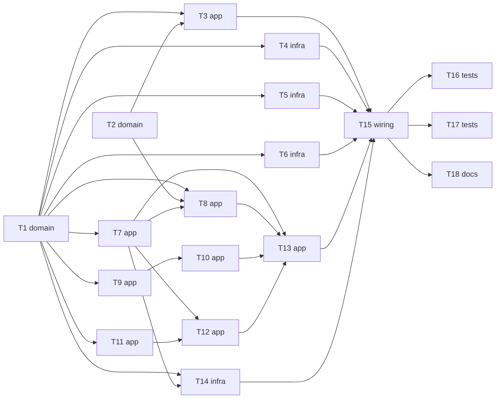

# Epic: kafka-request-reply

> **Spec:** [spec.md](../spec.md) · **Design:** [sad.md](../sad.md) · **Data model:** none (no schema change) · **API:** [public-api.md](../contracts/public-api.md), [events.md](../contracts/events.md) · **ADRs:** [adr/](../adr/)

## Goal

Ship a Spring Boot starter where a team supplies only a Handler and configuration, and gets cross-worker Rate Budget enforcement, weighted Priority Lanes, per-request timeouts with Error Replies and atomic reply commit (spec §2).

## Scope

- **In:** domain types and pure logic, engine (intake, executor, commit, state), Kafka, shared-store and Micrometer adapters, auto-configuration, failure, rollout and load tests, starter guide.
- **Out:** exactly-once Handler effects, per-Requester reply routing, deployments without stable identity, latency guarantees beyond the Cycle bound, open-source library, CPU-heavy Handlers (spec §3).

## Task map

## Tasks

See [tracker.md](./tracker.md) for status. Machine contract: [tasks.json](../tasks.json).

| # | Task | Layer | Blocked by | DoD (short) |
|---|---|---|---|---|
| T1 | [Define public API types, ports and Idempotency Key](./api-types-and-ports.md) | domain | none | Unit tests prove the Idempotency Key is identical across re-executions and replies carry correlation id and Request Key unchanged. |
| T2 | [Implement lane share calculator (weights, 5% minimum, idle redistribution)](./lane-share-calculator.md) | domain | none | Unit tests show lane shares follow weights, no busy lane drops below 5%, and idle shares are redistributed. |
| T3 | [Add configuration properties and startup validation](./config-and-startup-validation.md) | app | T1, T2 | A misconfigured worker (conflicting timings, weight ≤ 0, no Handler, no identity) refuses to start with a message naming the conflict. |
| T4 | [Implement the Redis-compatible AllowanceStore adapter](./allowance-store-adapter.md) | infra | T1 | Two clients on one Redis-compatible store never take more than the Rate Budget (× 1.10) in a sliding second, and an unreachable store raises the fail-closed exception. |
| T5 | [Implement the Kafka RequestLanes adapter with stable worker identity](./kafka-request-lanes-adapter.md) | infra | T1 | A worker restarted with the same identity within 45 s regains its lanes and the other worker is never reassigned. |
| T6 | [Implement the transactional Kafka ReplySink](./kafka-transactional-reply-sink.md) | infra | T1 | Replies and request positions commit atomically; a re-run Cycle never yields a second committed reply to a committed-only reader. |
| T7 | [Implement worker pause and stall state machine](./pause-and-stall-state.md) | app | T1 | With a fake clock, a worker with pending work and no commit for 60 s reports stalled, an idle or paused worker never does. |
| T8 | [Implement intake: reserve allowance, weighted fetch, return unused, fail closed](./intake-with-allowance.md) | app | T1, T2, T7 | Intake never fetches more than the reserved allowance, returns unused units, spends none on malformed input and fails closed when the store is unreachable. |
| T9 | [Implement Handler execution: virtual threads, timeout, cancellation, Error Replies](./handler-executor.md) | app | T1 | A failing or slow Handler yields exactly one Error Reply (failure or timeout), is never re-run, and no request outlives the Cycle deadline. |
| T10 | [Add per-Request-Key ordering inside a lane](./per-key-ordering.md) | app | T9 | Requests with the same Request Key in a lane run in arrival order while other keys run in parallel. |
| T11 | [Assemble the Cycle commit and turn undeliverable replies into Error Replies](./cycle-commit-and-undeliverable.md) | app | T1 | A reply that cannot be delivered is replaced by an Error Reply in the same commit, other requests are unaffected and no Handler re-runs. |
| T12 | [Add commit retry, destination pause and resume](./commit-retry-and-destination-pause.md) | app | T7, T11 | Failed commits retry with the same results, an unavailable or forbidden destination pauses the worker in its group, and recovery re-commits without re-running Handlers. |
| T13 | [Implement the Cycle loop that ties intake, execution and commit together](./cycle-loop.md) | app | T7, T8, T10, T12 | With fake ports a request travels through intake, Handler and commit and the reply carries the request correlation id. |
| T14 | [Implement the Micrometer WorkerMetrics adapter](./micrometer-metrics-adapter.md) | infra | T1, T7 | Consistency Lag is recorded per lane for every committed reply, implausible samples are flagged and excluded. |
| T15 | [Wire the Spring Boot auto-configuration and startup permission check](./autoconfiguration-and-permission-check.md) | wiring | T3, T4, T5, T6, T13, T14 | A Handler bean plus configuration produces a running worker, and a missing destination permission pauses it instead of crashing it. |
| T16 | [Add the failure-scenario test suite](./failure-scenario-test-suite.md) | tests | T15 | Failure scenarios (kill, failed commit, destination down, store down, degraded downstream) all end with 0 lost and 0 duplicated committed replies. |
| T17 | [Add rollout, weight-accuracy and throughput tests](./rollout-and-load-tests.md) | tests | T15 | Rolling restart shows 0 reassignments, accepted rate stays within budget × 1.10, lanes stay within ±10 points, throughput is measured against 2,000 requests/s. |
| T18 | [Write the starter guide and operator runbook](./starter-guide-and-runbook.md) | docs | T15 | The guide states committed-reads-only, same-key-one-lane, cooperative cancellation next to the Idempotency Key note, and the stranded-lane runbook. |

## Risks / Hard rules

- Payload content is never copied into logs, metrics or Error Replies (spec §6.1).
- Web and REST client dependencies must not leak into the starter contract (sad §2).
- The `engine` core imports no platform client, store client or metrics registry; only ports (sad §5).
- Open before or during implementation (sad §11, spec §8): trigger and deadline, provisional timing numbers, ordering scope of AC-07c, shared-store client choice (T4), Error Reply format (OQ-1).
