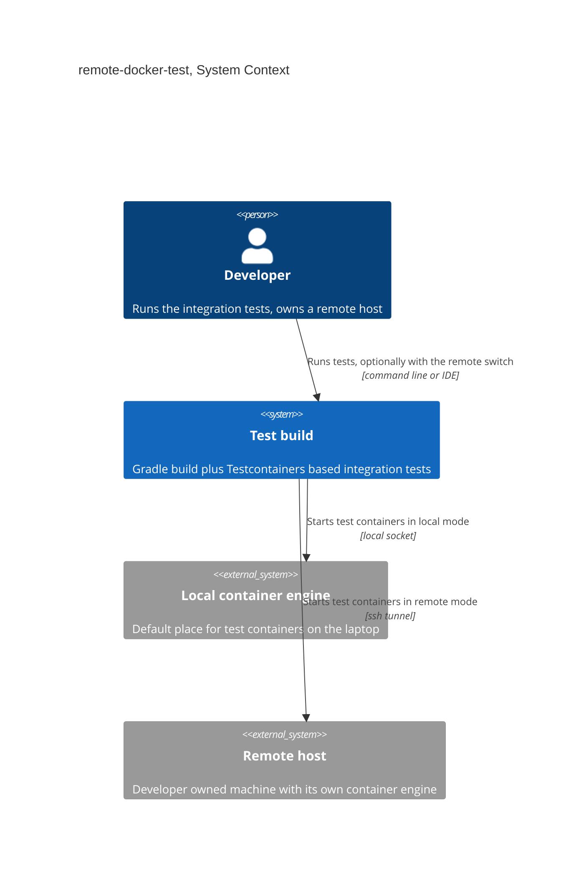
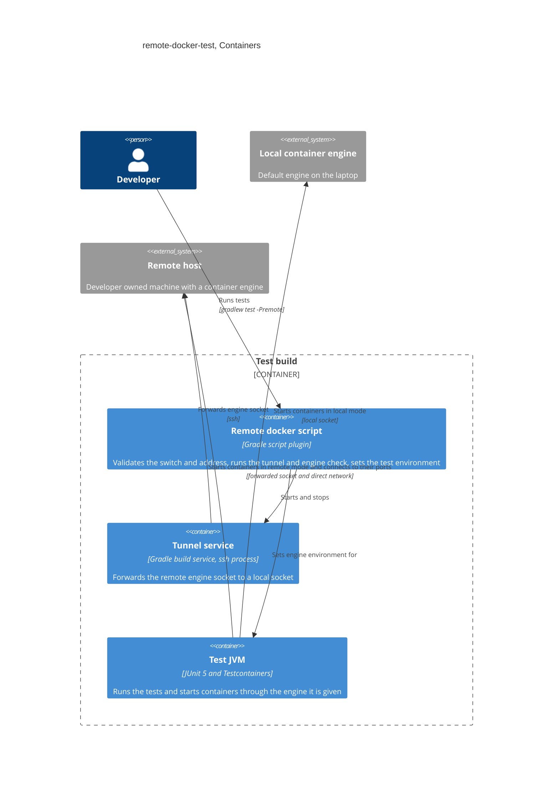

# Software Architecture Document — remote-docker-test

## 1. Introduction and goals

**Intent.** Let a Developer run the repository's container-based tests on their own remote host instead of their laptop, selected by one build switch, with local Docker staying the default (spec §2).

**Top-3 quality goals (1-liners; full scenarios in §10):**

1. Security: the remote engine is only ever reached over an authenticated channel, and no address is stored in the project.
2. Predictability: every run states where it ran, and a wrong or missing remote setup stops the run fast, never falling back silently.
3. Offload: with the switch on, no test container runs on the Developer's machine and the suite stays near local speed.

**Stakeholders.**

| Role | Interest | Sign-off owner? |
|---|---|---|
| Developer | runs tests locally or on own remote host | No |
| Security Lead | review of the remote-engine trust boundary | Yes |
| Tech Lead | SAD approval | Yes |

<!-- Decision overrides (¶4) — populated by the critic resolution loop, empty otherwise. -->

## 2. Constraints

**Technical.**
- Java 25, Gradle build, Spring Boot 4.1.1 (`build.gradle`).
- Test containers come from Testcontainers (version managed by the Spring Boot dependency management), images `apache/kafka:4.2.2` and `redis:7`, all defined in `TestcontainersConfiguration`.
- Testcontainers picks its container engine once per test JVM from environment variables or `~/.testcontainers.properties`, before any test code or Spring context runs (the shared broker starts in a static initializer).
- Testcontainers has no native `ssh://` support (upstream request closed as not planned) and bundles its own Docker client, so an `ssh://` host cannot be passed to it directly.
- The `ssh` command-line client must exist on the Developer's machine.

**Organisational.**
- Size S, about one week, one Developer, no deadline (spec §1).

**Conventions.**
- Test setup stays in one place: `TestcontainersConfiguration` names images, no other class does.
- `*IT` and the Spring smoke test fail without a container engine on purpose (build.gradle comment), so remote mode must fail rather than skip.

**Regulatory / external.**
- None. Test data is synthetic (spec §6.1).

## 3. Context and scope

The Developer runs Gradle test commands from the laptop. By default the tests start Kafka and Redis containers on the laptop's container engine. In remote mode the build opens a secure tunnel to the Developer's own remote host and the tests start the same containers on its engine instead.

<!-- brownfield: Gradle `test` task with JUnit 5 plus Testcontainers 'shared broker' in TestcontainersConfiguration, FailureHarness (Redis), load and pre-release test tasks; no resources dir, no test profile mechanism today. -->

**External systems (in / out):**

| Actor or system | Type | Interaction |
|---|---|---|
| Developer | Person | runs tests, optionally with the remote switch, sets own host address once |
| Local container engine | System (internal) | default place for test containers |
| Remote host | System (internal, Developer-owned) | runs the container engine for remote mode, reached over ssh |

**C4 Context (L1):**



## 4. Solution strategy

**Top strategic choices (the seeds for ADRs):**

1. **One build switch translates into the container tooling's own settings** (ADR-0001) — the Gradle flag `-Premote` makes the build set the engine environment variables for the test JVM, because Testcontainers fixes its engine before any test code runs. Without the flag the build clears the variables that point off the machine (a remote engine address or a host override) and leaves a local engine setting, such as a Colima or Podman socket, untouched, so a no-switch run is local. Serves goals 2 and 3.
2. **The build owns an ssh tunnel to the remote engine** (ADR-0002) — the build starts `ssh` forwarding the remote engine socket to a local socket and closes it after the run; Testcontainers then talks to a local socket and the host override points container ports at the remote host. The channel is authenticated by ssh by construction. Serves goal 1.
3. **Verify the target in the build, before any test starts** (ADR-0003) — the build checks the address, the tunnel and the engine answer, then prints the target, all before the first test JVM. Serves goal 2.

Target surface: `cli`. The feature is a developer-facing command-line switch in the build, with no service, no UI and no worker. §5 shows the build's own components, which together are the `cli` surface.

**Ledger of decisions made without asking (easy depth):**

- Per-user setting: `remoteDocker.host=ssh://user@host` in `~/.gradle/gradle.properties` (outside the project, one setting per machine serves every checkout, spec AC-05). Optional `remoteDocker.socket` (default `/var/run/docker.sock`).
- The switch is the Gradle property `-Premote` (CLI or IDE Gradle run configuration).
- Build logic lives in a script plugin `gradle/remote-docker.gradle` applied from `build.gradle`, and the tunnel is a Gradle build service so it closes even when a run fails.
- Remote mode forces the `test` task to always run, and the mode is a task input so a mode change re-runs it (spec AC-03, AC-03b).
- `loadTest` and `preReleaseTest` are refused in remote mode (spec AC-09). The performance tests inside `test` run remotely (user decision in clarify).
- Banner line at task start: `Container target: local` or `Container target: remote ssh://user@host`.
- One 30 second budget, measured from the start of the run, covers validation, tunnel start and engine ping together (spec AC-06, AC-08).
- The Ryuk reaper container mounts the engine socket, so in remote mode the build also sets `TESTCONTAINERS_DOCKER_SOCKET_OVERRIDE` to `remoteDocker.socket`, the socket path on the remote host (to be verified in the first task).
- Cleanup of leftover containers stays with Testcontainers' own reaper container (Ryuk), reached through the host override. Orphans after a dead run are left to Testcontainers' reaper (spec §8).

## 5. Building block view

The feature adds build logic only: one Gradle script plugin plus a small amount of test-task wiring. No application code changes. Structure is a pipeline in the build: validate → open tunnel → check engine → run tests → close tunnel.

**Internal decomposition:**

```
build.gradle                  applies gradle/remote-docker.gradle, test task wiring
gradle/remote-docker.gradle   switch + address validation, tunnel build service, engine check, banner
~/.gradle/gradle.properties   per-user: remoteDocker.host (outside the project)
docs/features/remote-docker-test/  spec, SAD, ADRs
```

**C4 Container (L2):**



## 6. Runtime view

**Critical flow 1: remote run**

```mermaid
sequenceDiagram
    actor Dev as Developer
    participant Script as Remote docker script
    participant Tunnel as Tunnel service
    participant Remote as Remote host
    participant Tests as Test JVM

    Dev->>Script: run tests with remote switch
    Script->>Script: check address is set and is an ssh address
    Script->>Tunnel: open tunnel to remote engine
    Tunnel->>Remote: forward remote engine socket
    Remote-->>Tunnel: connected
    Script->>Remote: ping engine through the tunnel
    Remote-->>Script: engine answers
    Script-->>Dev: Container target: remote
    Script->>Tests: start with engine environment set
    Tests->>Remote: start containers and connect to their ports
    Tests-->>Script: results
    Script->>Tunnel: close tunnel
    Script-->>Dev: test report
    alt address missing or not ssh
        Script-->>Dev: stop, name the missing or refused setting and say it goes in the per-user Gradle properties file
    else tunnel does not open within 30 seconds
        Script-->>Dev: stop and name the address tried
    else engine does not answer within 30 seconds
        Script-->>Dev: stop and say the container service on the remote host is not running
    else loadTest or preReleaseTest requested
        Script-->>Dev: stop and say these tasks are local-only; run them without the remote switch
    end
```

**Critical flow 2: local run** — the script clears engine environment variables that point to another machine (a local socket is kept), refuses the run when the user-level Testcontainers file points elsewhere, prints `Container target: local` and starts the tests. No tunnel.

## 7. Deployment view

Laptop: Gradle, the test JVM, the optional ssh process. Remote host: a container engine reachable by ssh with the Developer's key, and its container ports reachable from the laptop over the private network. No service is deployed. No scaling thresholds apply, because each Developer has one remote host and runs one suite at a time.

**Monitoring:**
- Build log lines: target banner, tunnel start and stop, and engine ping result.
- Alerts: none. Failures stop the build with a message.
- Tracing: n/a.

**Scaling thresholds:**
- N/A: one Developer per remote host.

## 8. Crosscutting concepts

| Concept | Convention | Where defined |
|---|---|---|
| Logging | build lifecycle lines with a fixed prefix `[remote-docker]` | here |
| Authentication | ssh key or agent of the Developer, never a password stored in the project | ADR-0002 |
| Error handling | stop before any test with one message naming the setting or address, no fallback | ADR-0003 |
| ID strategy | N/A | — |
| Internationalisation | N/A, English messages | — |
| Observability | target banner on every run in both modes | here |
| Events | N/A | — |

## 9. Architecture decisions

| # | Title | Status | Section |
|---|---|---|---|
| 0001 | Switch remote mode with a Gradle property that sets the engine environment | Accepted | §4 |
| 0002 | Reach the remote engine through a build-managed ssh tunnel | Accepted | §4 |
| 0003 | Verify the container target in the build before any test starts | Accepted | §4 |

ADR files live under `docs/features/remote-docker-test/adr/NNNN-<title>.md`.

## 10. Quality requirements

**QG-1. Security**
- **When:** a Developer selects remote mode with an address that is not an authenticated form, or commits project changes.
- **Then:** the run is refused for any non-ssh address, and 0 remote host addresses are in the project.
- **How verify:** build-level test of the validation rules and a repository scan of tracked files and the working tree.

**QG-2. Predictability**
- **When:** the remote host is down, or ssh works but the container service is not running.
- **Then:** the run stops within 30 s (spec §6: unreachable-host detection ≤ 30 s), names the address, and starts no container on the Developer's machine.
- **How verify:** timed runs against a stopped host and against a host with its container service stopped.

**QG-3. Offload**
- **When:** a Developer runs the normal test command in remote mode.
- **Then:** 0 containers on the Developer's machine, and suite duration at most 150% of local (spec §6; §8: no visible impact observed).
- **How verify:** container list on the laptop after a run, and a timed local versus remote run of the same suite from the same machine.

## 11. Risks and technical debt

| Risk / debt | Severity | Mitigation | Owner |
|---|---|---|---|
| Container ports on the remote host are not reachable from the laptop (VPN or firewall rules) | High | the engine check also opens a test connection to a throwaway port, or documents the required rules | I.Chupryna |
| Ambient settings in `~/.testcontainers.properties` may send a no-switch run remote even with a cleared environment | High | decided by the open architectural decision row below, no ADR until the precedence is known | I.Chupryna |
| The failure suite picks a free port on the laptop and pins it on the remote host | Medium | choose the port from the remote side or avoid fixed host ports in remote mode | I.Chupryna |
| Timing-sensitive tests flake over the VPN | Medium | same thresholds in both modes (spec §8: no visible impact); remote-only timing failures recorded in verification.md | I.Chupryna |
| Tunnel dies with the VPN mid-run, failing every later test | Medium | accepted, the run fails visibly, rerun after reconnecting | I.Chupryna |
| Leftover containers on the remote host after a killed run | Low | left to Testcontainers' reaper (spec §8); manual prune otherwise | I.Chupryna |
| Resolved (T1, `spike-findings.md`): env vars beat the user file, so remote mode sets them; local mode clears them and refuses with a message naming `~/.testcontainers.properties` when it points off the machine | Closed | spec AC-01 note added in spike-findings §2 | I.Chupryna |

**Accepted debt (acceptable in v1, plan to fix later):**
- Only the ssh form is supported. A certificate-secured network address is a possible later feature (spec AC-10 was narrowed to ssh).

## 12. Glossary

| Term | Meaning |
|---|---|
| Developer | a person who runs this repository's tests from their own machine and owns their own remote host |
| Local mode | default test run on the Developer's own machine |
| Remote mode | test run selected by `-Premote`, containers on the remote host, never chosen automatically and never a fallback |
| Remote host | the Developer's own remote host, not shared with other Developers |
| Tunnel | an ssh connection forwarding the remote engine socket to a local socket |
| Host override | Testcontainers setting naming the machine whose ports the tests connect to |
