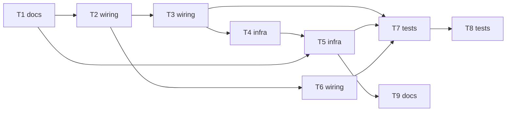

# Epic: remote-docker-test

> **Spec:** [spec.md](../spec.md) · **Design:** [sad.md](../sad.md) · **ADRs:** [adr/](../adr/)

## Goal

Ship a `-Premote` switch in the build so a Developer can run the container tests on their own remote host over an ssh tunnel, with local mode unchanged by default (spec §2 Goals).

## Scope

- **In:** the Gradle script plugin, test task wiring, ssh tunnel, engine check, validation, TestKit tests, a real-host verification and a how-to.
- **Out:** CI setup, provisioning the remote host, shared hosts, remote runs of the load commands, automatic cleanup of leftover containers (spec §3).

## Task map

## Tasks

See [tracker.md](./tracker.md) for status. Machine contract: [tasks.json](../tasks.json).

| # | Task | Layer | Blocked by | DoD (short) |
|---|---|---|---|---|
| T1 | Check engine settings precedence and Ryuk socket handling, record the result | docs | none | `spike-findings.md` names the precedence result and the Ryuk socket value, each with the command or test used |
| T2 | Add the remote switch script plugin and wire the test task environment | wiring | T1 | a no-switch run prints `Container target: local` and starts containers on the local engine |
| T3 | Validate the remote address from the per-user setting and refuse bad forms | wiring | T2 | missing property stops the run with the setting and file named, before any container |
| T4 | Open and close the ssh tunnel as a build service within the time budget | infra | T3 | a run against a stopped host stops within 30 s naming the address and starts no container locally |
| T5 | Ping the remote engine through the tunnel and set the reaper socket override | infra | T4, T1 | with the engine stopped on the remote host the run stops within 30 s with the container-service message |
| T6 | Refuse loadTest and preReleaseTest when the remote switch is on | wiring | T2 | both load commands fail fast with the local-only message when `-Premote` is set |
| T7 | Test the build logic with Gradle TestKit using a fake ssh and fake engine | tests | T3, T5, T6 | TestKit tests cover AC-01, AC-03, AC-03b, AC-04 to AC-10 and pass |
| T8 | Verify remote mode against the real remote host and record findings | tests | T7 | `verification.md` shows 0 containers on the laptop, the timings for both failure modes, and the remote vs local duration |
| T9 | Write the developer how-to for remote mode | docs | T5 | a new Developer can follow the how-to to a first remote run (setup time recorded against the 15 minute KPI in T8) |

## Risks / Hard rules

- No silent fallback to local, no address in the project, 30 s limit for unreachable detection, 0 containers on the laptop in remote mode.
- T2 to T6 edit the same script and are serialized. T7 and T9 can run in parallel.
- Open decision resolved by T1: how a no-switch run is forced local against `~/.testcontainers.properties`.
